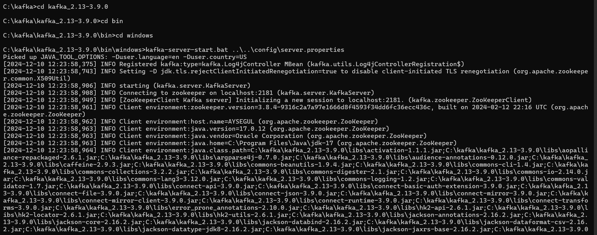
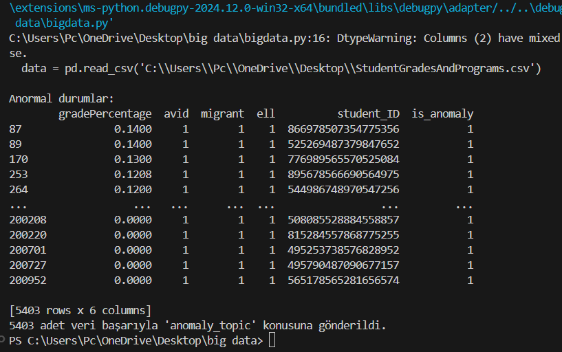

                                                                  ANOMALY DETECTİON USİNG KAFKA AND SPARK

PREPROCESSİNG STEPS

1-Removal of missing data

2-Data Normalize and Encoding

3-Outlier Process

4-Data Visualization

4.1-Histogram Chart

4.2.-Boxplot Chart

4.3. Correlation Matrix

4.4.-Scatter Plot Chart

5-Artificial İntelligence Model Development and Report

5.1.-Random Forest Model

5.2.-Decision Tree Model

5.3.Logistic Regression Model

KAFKA
1.-Kafka Setup

2.-Sending Data to Topic

3.- Retrieve Data from Topic

SPARK
1-Interface

                                                                    
                                                                    
